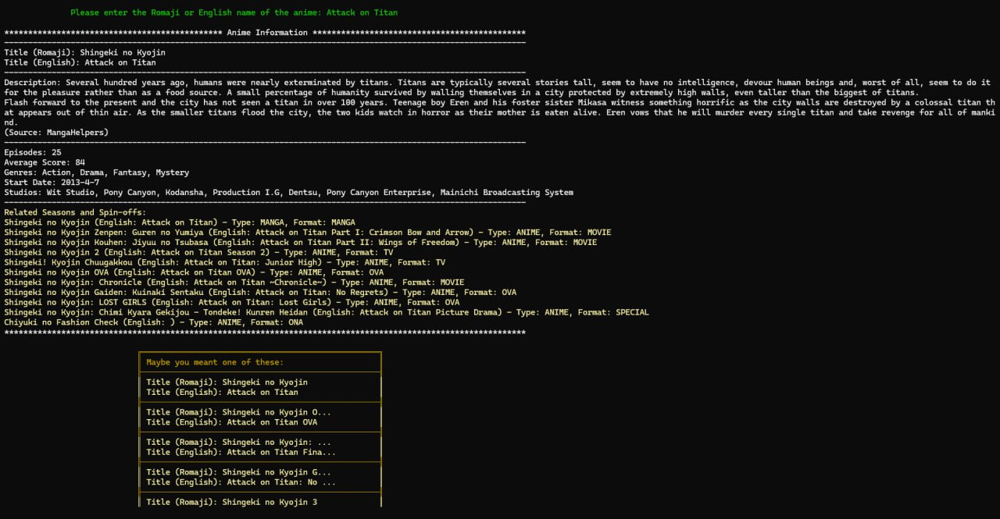
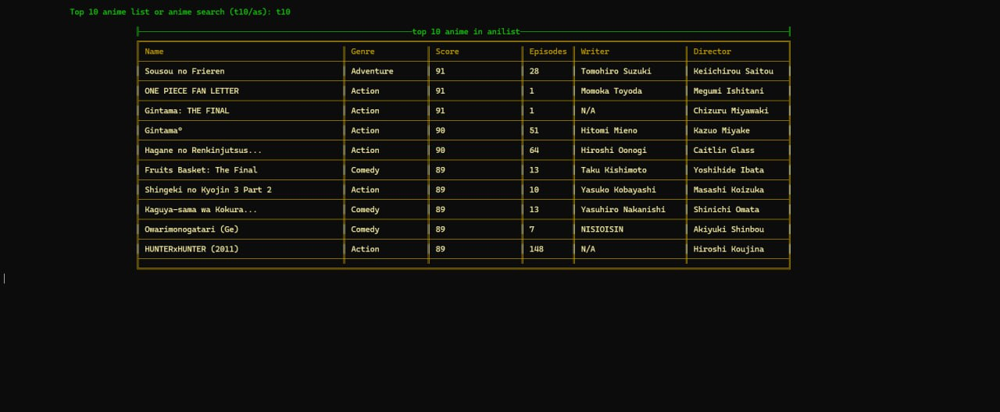
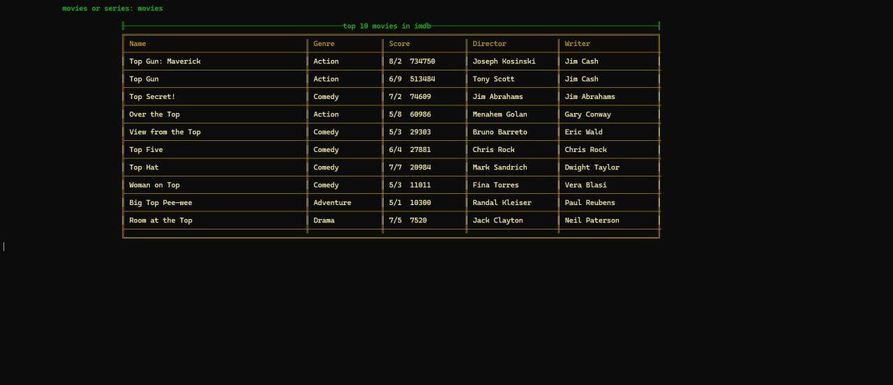

# MAS Console: movie anime series (Console.ver) 🎥

A **C# console Application** for searching and exploring anime movies and series!
Version: 2.0

---

**⏬[Download](https://github.com/TheGreatAzizi/MAS-Console/releases/download/v2.0/MAS.exe)**

---

## Features ✨
- 🍿 **Anime**: Search for anime using Romaji and English names and get its complete information, including the order of watching related anime
  - Description
  - Release Date
  - Genre
  - Rating and .....
 - 🍿 **Movie**: In this version, only you can get the list of **top 10 movies and series**
    In the next version, the possibility of **searching movies and series will be added**
- 🌐 **API Integration**: Fetch real-time data from an anime database [AniList API](https://anilist.gitbook.io/anilist-apiv2-docs/) [OMDB API](http://www.omdbapi.com) .

---

## Screenshots 🖼️

    
    
    

---

## Note ⚠️
**Due to the filtering of anilist website APIs in Iran, you must use a VPN**
> You may need to install .net 8 to run

